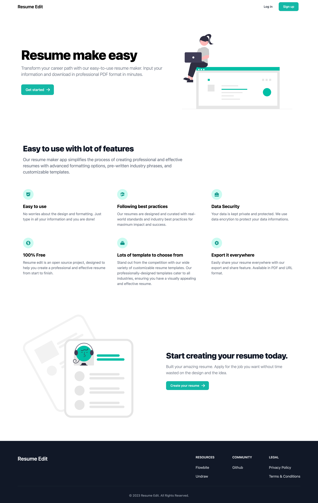
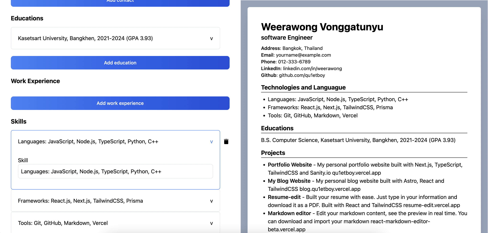

# Resume Edit V2

[](https://resume-edit-v2.vercel.app/)

A better resume maker (old version can be found [here](https://github.com/Qu1etboy/resume.edit))

## Stack

- **Framework**: [Next.js](https://nextjs.org/)
- **Authentication**: [NextAuth](https://next-auth.js.org/)
- **Database**: [MongoDB](https://www.mongodb.com/), [Railway](https://railway.app/)
- **Styling**: [TailwindCSS](https://tailwindcss.com/)
- **Deployment** [Vercel](https://vercel.com/)

## TODO

- [ ] Provide more resume template to should from

## Preview





## Running Locally

- Install dependencies

```bash
npm install
```

- Setup `.env` similarly to `.env.example`

- Start the development server

```bash
npm run dev
```

Open [http://localhost:3000](http://localhost:3000) with your browser to see the result.
